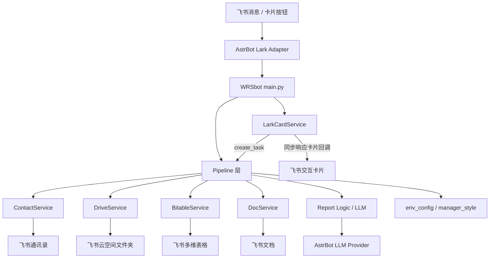
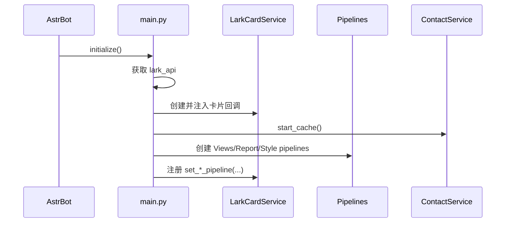
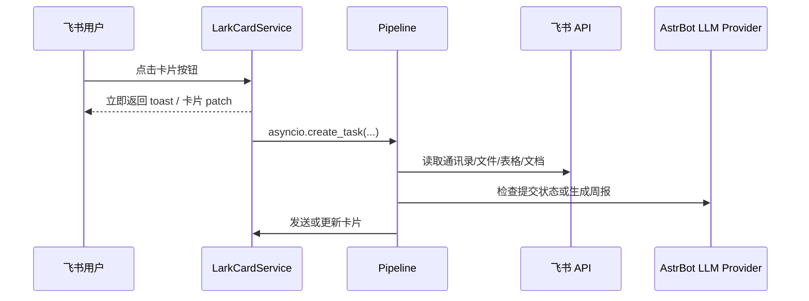

# WRSbot - 飞书部门周报汇总助手

WRSbot 是一个运行在 [AstrBot](https://github.com/AstrBotDevs/AstrBot) 平台上的飞书/Lark 插件，用于自动化部门周报收集、提交状态检查、AI 汇总、管理者风格改写以及回写周报文件。  

AstrBot 负责插件生命周期、消息事件、LLM Provider 和飞书平台适配；WRSbot 负责具体的周报业务流程。

> Author: Justin Lee (Qaz-hw)  
> Version: v1.0.0  
> Platform: AstrBot + Feishu/Lark

---

## 项目功能

### 1. 部门周报文件夹绑定

WRSbot 以「部门」为单位绑定飞书云文档文件夹。部门负责人通过卡片流程完成绑定后，插件会把对应部门的文件夹 token 写入插件目录下的 `.env`。

绑定后的部门可以：

- 自动查找本周周报文件。
- 支持多维表格 Bitable 和飞书文档 Doc/Docx。
- 向成员返回本部门周报填写入口。
- 让部门负责人查看本周提交状态并发起汇总。

### 2. 周报提交状态检查

插件会读取飞书通讯录中的部门成员，并结合本周周报文件内容，通过 LLM 判断：

- 哪些成员已经提交。
- 哪些成员尚未提交。
- 当前周报文件是否为空、质量不足或字段异常。
- 管理视图中展示提交比例、已提交名单和未提交名单。

### 3. AI 周报汇总

部门负责人可以从管理卡片发起本周周报汇总。当前实现采用三阶段生成流程：

1. `extract`: 按成员/记录提取事实信息。
2. `plan`: 合并事实，生成部门周报结构规划。
3. `write`: 流式生成最终周报文本，并推送到飞书流式卡片。

这套流程位于 `services/report.py`，由 `services/pipelines/report.py` 负责调用和编排。

### 4. 管理者个人写作风格

部门负责人可以配置个人周报风格，包括：

- 风格标签。
- 自定义写作要求。
- 历史写作样本。

保存时会尽量结构化为更稳定的风格参数，并存入 AstrBot 的 `sp` 存储。后续生成和改写周报时会读取这些配置，使输出更接近管理者自己的表达方式。

### 5. 改写与提交

AI 生成初稿后，管理者可以：

- 输入改写要求，重新生成一版。
- 确认后提交。

提交时根据本周文件类型选择不同写入方式：

- Bitable: 自动识别表格字段，尝试把周报不同章节映射到对应列，并写入或更新「部门总结」行。
- Doc/Docx: 将最终周报作为新内容追加到文档末尾。

### 6. 催交提醒

管理者可以从管理视图触发提醒。WRSbot 会根据提交检查结果，把用户视图卡片发送给未提交成员，提醒其尽快填写。

### 7. 自然语言入口

除 slash command 和卡片按钮外，WRSbot 还支持自然语言触发。插件会先用关键词做低成本预过滤，再用 LLM 做意图分类。

当前主要意图：

- `generate_summary`: 管理者请求生成/查看部门周报汇总。
- `get_writing_folder`: 成员想获取本周周报填写入口。
- `none`: 其他无关消息。

---

## 整体架构



核心思想是：`main.py` 只作为插件入口和依赖装配层，真正的业务流程由 `services/pipelines/` 和各领域服务负责。

---

## 代码结构

```text
astrbot_plugin_WRSbot/
├── main.py
├── metadata.yaml
├── README.md
├── services/
│   ├── lark_card.py
│   ├── contact.py
│   ├── drive.py
│   ├── bitable.py
│   ├── doc.py
│   ├── report.py
│   └── pipelines/
│       ├── __init__.py
│       ├── _base.py
│       ├── views.py
│       ├── report.py
│       └── style.py
└── utils/
    ├── env_config.py
    └── manager_style.py
```

### `main.py`

插件入口。主要职责：

- 注册 AstrBot 插件。
- 初始化飞书 SDK、卡片服务、文档服务、表格服务、通讯录服务。
- 启动通讯录缓存。
- 创建 `ViewsPipelines`、`ReportPipelines`、`StylePipelines`。
- 将 pipeline 方法注册到 `LarkCardService`。
- 注册 AstrBot slash command 和消息事件监听器。

建议后续继续保持 `main.py` 的职责轻量化，不要把具体业务流程继续堆在这里。

### `services/lark_card.py`

飞书交互卡片服务。主要职责：

- 发送模板卡片和内联卡片。
- patch 已有卡片。
- 注入飞书 SDK 的 `p2.card.action.trigger` 回调处理器。
- 同步处理卡片按钮回调并立即返回飞书要求的响应。
- 将真正耗时的业务流程通过 `asyncio.create_task(...)` 转发给 pipeline。

注意：飞书卡片回调处理函数必须快速返回，因此不要在 `handle_card_action_sync` 中直接执行长耗时任务。

### `services/pipelines/`

业务编排层，连接卡片动作、飞书服务和 LLM 逻辑。

| 文件 | 职责 |
| --- | --- |
| `_base.py` | `PipelineBase`，保存共享服务引用，并提供通用 helper，比如流式卡片输出、本周文件查找、DM 文本发送 |
| `views.py` | 管理视图、用户视图、催交提醒、查看周报文档入口 |
| `report.py` | 生成周报、改写周报、提交周报 |
| `style.py` | 打开/保存管理者个人风格配置 |

### `services/report.py`

周报算法和 LLM prompt 集中地。主要包含：

- 提交状态检查 prompt。
- 周报生成 prompt。
- 改写 prompt。
- Bitable 字段映射 prompt。
- `check_submissions(...)`
- `generate_report_stream_mapreduce(...)`
- `rewrite_summary_stream(...)`
- `split_report_to_columns(...)`

如果要改「AI 如何写周报」，优先看这个文件。

### `services/contact.py`

飞书通讯录服务。负责：

- 拉取根部门。
- 拉取部门成员。
- 获取用户资料。
- 生成组织结构缓存。
- 判断某个 `open_id` 是否为部门负责人。

通讯录缓存默认每 5 小时刷新一次。

### `services/drive.py`

飞书云空间文件发现服务。负责：

- 列出绑定文件夹下的文件。
- 通过 ISO 周标签或日期范围识别本周文件。
- 规则无法命中时，可由调用方注入 LLM 文件选择函数作为兜底。

### `services/bitable.py`

飞书多维表格服务。负责：

- 列出表格。
- 列出字段。
- 读取记录。
- 查找或创建「部门总结」记录。
- 把表格记录序列化为 LLM 可读文本。

### `services/doc.py`

飞书文档服务。负责：

- 读取文档纯文本。
- 读取文档 block 并转换为近似 Markdown。
- 将最终周报追加写入文档尾部。

### `utils/env_config.py`

部门文件夹绑定配置。负责读写插件 `.env` 中的：

```text
DEPT_FOLDER_<open_department_id>
DEPT_URL_<open_department_id>
```

不要把真实 `.env` 提交到仓库。

### `utils/manager_style.py`

管理者个人风格配置。使用 AstrBot `sp` 存储：

```text
scope="global"
scope_id="wrsbot"
key="manager_style:<open_id>"
```

---

## 功能调用链

### 插件初始化



### 卡片按钮触发业务流程



### 周报生成流程


---

## 功能组如何调用

### 1. Command 入口

命令入口定义在 `main.py`，通过 AstrBot 的 `@filter.command(...)` 注册。

常用命令：

| 命令 | 用途 |
| --- | --- |
| `/Hello` | 发送 WRSbot 欢迎卡片 |
| `/文件夹配置` | 打开部门文件夹绑定流程 |
| `/清除所有绑定` | 清除本地 `.env` 中的部门绑定，仅用于开发测试 |
| `/whoami` | 输出当前消息、发送人、平台、会话等调试信息 |
| `/test_llm <问题>` | 测试 AstrBot 当前 LLM Provider |
| `/test_feishu_contact` | 测试飞书通讯录读取 |
| `/test_cached_feishu_contact` | 查看缓存通讯录 |
| `/dump_bindings` | 查看当前部门绑定摘要 |
| `/check_user` | 检查当前用户资料 |
| `/list_contacts` | 输出通讯录成员 |
| `/my_style` | 查看当前管理者风格配置 |
| `/set_doc_folder <token>` | 保存测试用文档文件夹 token |
| `/test_feishu_doc [folder]` | 测试飞书文档读取 |
| `/test_weekly_file [folder]` | 测试本周文件识别逻辑 |

群聊中部分 slash command 会先经过 `group_command_dispatcher`，避免被 AstrBot 默认 LLM 流程直接消费。

### 2. Card Action 入口

卡片按钮动作在 `services/lark_card.py` 的 `handle_card_action_sync(...)` 中分发。

主要 action：

| Action | 调用目标 | 功能 |
| --- | --- | --- |
| `wrsbot_start` | `views.admin_view` 或 `views.user_view` | 根据角色进入管理视图或用户视图 |
| `start_binding` | `LarkCardService` 内部逻辑 | 开始部门文件夹绑定 |
| `send_folder_url` | `env_config.set_dept_folder_token` | 保存部门文件夹 token/url |
| `rescan_org_tree` | `ContactService` | 刷新通讯录缓存 |
| `start_summary` | `ReportPipelines.generate` | 生成周报总结 |
| `rewrite_summary` | `ReportPipelines.rewrite` | 按输入要求改写草稿 |
| `submit_summary` | `ReportPipelines.submit` | 写回 Bitable 或 Doc |
| `summary_reminder` | `ViewsPipelines.reminder` | 向未提交成员发送提醒 |
| `view_doc` | `ViewsPipelines.view_doc` | 发送本部门周报文件夹链接 |
| `open_style_config` | `StylePipelines.open_style_config` 或卡片内联展示 | 打开风格配置 |
| `save_manager_style` | `StylePipelines.save_manager_style` | 保存管理者风格 |

### 3. 自然语言入口

自然语言入口在 `main.py` 的 `natural_report_trigger(...)`。

调用流程：

1. 仅处理飞书消息。
2. 跳过 `/` 开头的命令。
3. 用关键词判断是否可能和周报相关。
4. 调用 LLM 分类意图。
5. 根据意图和用户角色转发到对应 pipeline。

如果未来要增加新的自然语言能力，建议在这里扩展意图枚举和路由逻辑。

---

## 本地运行

WRSbot 作为 AstrBot 插件运行，不单独启动服务。

在 AstrBot 根目录：

```bash
uv sync
uv run main.py
```

AstrBot 默认 API 服务地址：

```text
http://localhost:6185
```

Dashboard:

```bash
cd dashboard
pnpm install
pnpm dev
```

Dashboard 默认地址：

```text
http://localhost:3000
```

---

## 配置说明

### 飞书平台配置

需要在 AstrBot 后台配置飞书/Lark 平台，包括 App ID、App Secret、Encrypt Key、Verification Token 等平台参数。

### LLM Provider

WRSbot 依赖 AstrBot 中已配置的 LLM Provider 完成：

- 自然语言意图识别。
- 提交状态分析。
- 周报生成。
- 周报改写。
- Bitable 字段映射。
- 管理者风格结构化。

### 插件 `.env`

复制 `.env.example` 为 `.env`，或通过卡片绑定流程自动写入部门文件夹配置。

示例：

```env
DEPT_FOLDER_od_xxxxxxxxxxxxxxxxxxxxxxxxxxxxxxxx=fldcnxxxxxxxxxxxx
DEPT_URL_od_xxxxxxxxxxxxxxxxxxxxxxxxxxxxxxxx=https://example.feishu.cn/drive/folder/xxxx
```

`.env` 已被 `.gitignore` 忽略，不要提交真实配置。

---

## 飞书权限

根据当前功能，飞书应用至少需要以下类型的权限：

| 权限方向 | 用途 |
| --- | --- |
| 通讯录读取 | 读取部门、成员、负责人，用于判断管理者和提交名单 |
| 云空间文件读取 | 读取绑定文件夹和本周文件元信息 |
| 文档读取/写入 | 读取周报文档并追加部门总结 |
| 多维表格读取/写入 | 读取成员周报记录并写入部门总结行 |
| 消息发送 | 发送私聊消息、卡片、提醒 |
| 群消息/私聊消息读取 | 接收命令和自然语言触发 |
| 交互卡片 | 发送、更新和处理飞书卡片 |

具体 scope 应以飞书开放平台后台和 AstrBot 飞书适配器要求为准。

---

## 测试建议

### 1. 静态检查

在 AstrBot 根目录运行：

```bash
ruff format .
ruff check .
```

如果只想先确认插件 Python 语法，可以对插件目录做编译检查；若本地 `__pycache__` 权限异常，可先清理对应缓存后再运行。

```bash
python -m compileall data/plugins/astrbot_plugin_WRSbot
```

### 2. 基础连通性

在飞书中测试：

```text
/whoami
/Hello
/test_llm hello
/关于WRSbot
```

确认：

- 消息能进入 AstrBot。
- 当前平台确认为 Lark/Feishu。
- `open_id` 能正常获取。
- LLM Provider 可用。

### 3. 通讯录测试

```text
/test_feishu_contact
/test_cached_feishu_contact
/list_contacts
/check_user
```

确认：

- 飞书通讯录权限已开通。
- 部门负责人能被识别。
- `ContactService` 缓存正常刷新。

### 4. 文件夹绑定测试

```text
/文件夹配置
/dump_bindings
```

建议检查：

- 负责人能看到需要绑定的部门。
- 提交文件夹链接后 `.env` 中写入对应 `DEPT_FOLDER_*`。
- 非负责人不会误进入管理绑定流程。

### 5. 本周文件识别测试

```text
/test_weekly_file <folder_token_or_url>
```

建议准备以下文件名进行覆盖：

- 包含 ISO 周标签，如 `2026-W21 部门周报`。
- 包含日期范围，如 `2026.5.18-2026.5.24 周报`。
- 无明显规则的文件名，用于验证 LLM fallback。

### 6. Bitable/Doc 读取测试

```text
/test_feishu_doc <folder_token_or_url>
```

建议分别测试：

- 飞书 Doc/Docx。
- 飞书 Bitable。
- 空文档。
- 字段缺失或成员未填写的表格。

### 7. 完整业务回归

推荐按以下顺序做一次端到端验证：

1. 部门负责人发送 `/Hello`。
2. 点击开始使用。
3. 完成部门文件夹绑定。
4. 进入管理视图，确认提交状态。
5. 点击催交，确认未提交成员收到提醒卡。
6. 点击开始周报汇总。
7. 等待流式卡片生成完成。
8. 输入改写要求并改写。
9. 点击提交。
10. 回到飞书 Bitable 或 Doc 检查写入结果。

---

## 后续开发建议

### 保持分层清晰

新增功能时优先按下面的边界放置代码：

- AstrBot command / event 入口：放在 `main.py`。
- 飞书卡片 UI、action 分发、patch：放在 `services/lark_card.py`。
- 多步骤业务流程：放在 `services/pipelines/`。
- 飞书 API 领域封装：放在 `services/contact.py`、`drive.py`、`bitable.py`、`doc.py`。
- LLM prompt、解析、生成算法：放在 `services/report.py` 或新的专门模块。
- 配置和持久化工具：放在 `utils/`。

### 避免循环依赖

推荐使用构造函数注入服务对象：

```python
common_args = (
    self.lark_api,
    self.context,
    self.contact_service,
    self.drive_service,
    self.bitable_service,
    self.doc_service,
    self.card_service,
)

self.views = ViewsPipelines(*common_args)
self.report = ReportPipelines(*common_args)
self.style = StylePipelines(*common_args)
```

pipeline 不应该反向 import `main.py`。

### 新增一个卡片功能的推荐步骤

1. 在飞书卡片模板或内联卡片中新增按钮，并定义 `action`。
2. 在 `services/lark_card.py` 的 `handle_card_action_sync(...)` 中处理该 action。
3. 如果是耗时流程，注册一个新的 pipeline 方法，并用 `asyncio.create_task(...)` 调用。
4. 把具体业务写在 `services/pipelines/` 中。
5. 如需调用飞书 API，优先扩展对应 service，而不是在 pipeline 中直接写 SDK 请求。
6. 如需调用 LLM，把 prompt 和解析逻辑放入 `services/report.py` 或新建领域模块。

### 新增自然语言能力的推荐步骤

1. 扩展 `main.py` 中的 `_INTENT_SYSTEM`。
2. 增加新的 intent 名称和置信度策略。
3. 在 `natural_report_trigger(...)` 中添加路由。
4. 路由到已有 pipeline，或创建新的 pipeline。
5. 确保低置信度和无关消息静默跳过，避免打扰群聊。

---

## 相关链接

- [AstrBot Repo](https://github.com/AstrBotDevs/AstrBot)
- [AstrBot Plugin Docs 中文](https://docs.astrbot.app/dev/star/plugin-new.html)
- [AstrBot Plugin Docs English](https://docs.astrbot.app/en/dev/star/plugin-new.html)
- [Feishu Open Platform](https://open.feishu.cn)
- [WRSbot Plugin Repo](https://github.com/Qaz-hw/astrbot_plugin_WRSbot)
